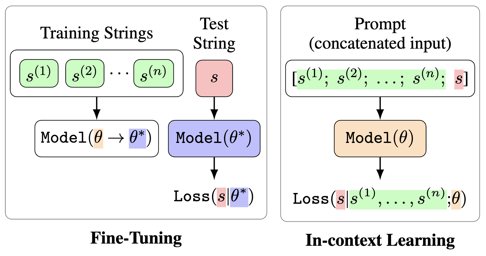
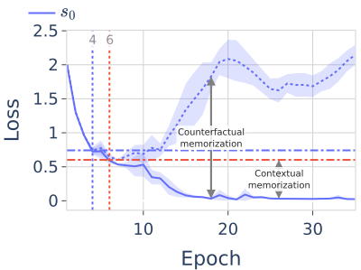

## Understanding the Foundations of Large Language Models via Formal Language Learning
Corresponding paper:
- Bishwamittra Ghosh, Soumi Das, Till Speicher, Qinyuan Wu, Mohammad Aflah Khan, Deepak Garg, Krishna P Gummadi, and Evimaria
Terzi. **Fine-tuning vs. in-context learning in large language models: A formal language learning perspective**. In Submission, 2025. URL: https://openreview.net/pdf?id=NZiaZoTaNq
\
\



- Bishwamittra Ghosh, Soumi Das, Qinyuan Wu, Mohammad Aflah Khan, Krishna P Gummadi, Evimaria Terzi, and Deepak Garg. **Learning without memorizing considered infeasible: Rethinking memorization in LLMs**. In Submission, 2025. URL https://openreview.net/pdf?id=KryACG4LGT.
\
\



## Installation
The code is tested on Python 3.10
```
pip install -r requirements310.txt
```

## Directory Structure
- grammar_learning/training: training scripts
- grammar_learning/benchmark: scripts to generate formal language benchmarks
- grammar_learning/read_output: auxiliary scripts for processing results and plotting
- grammar_learning/data: directories for formal language benchmarks